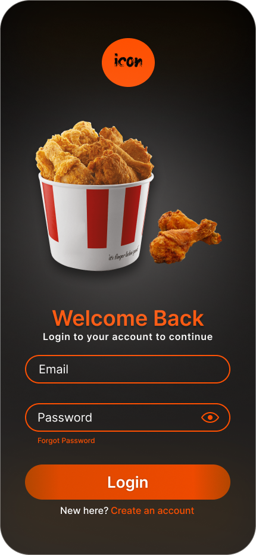
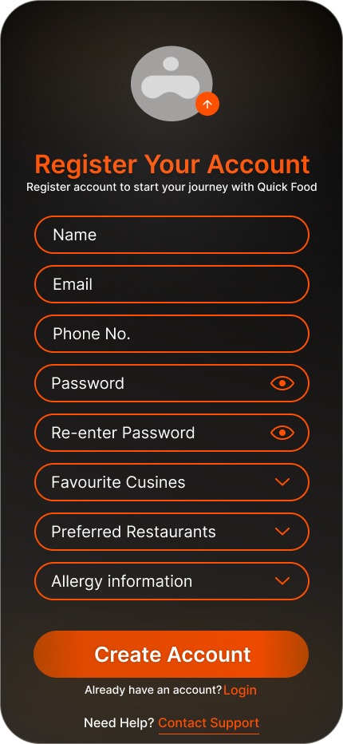
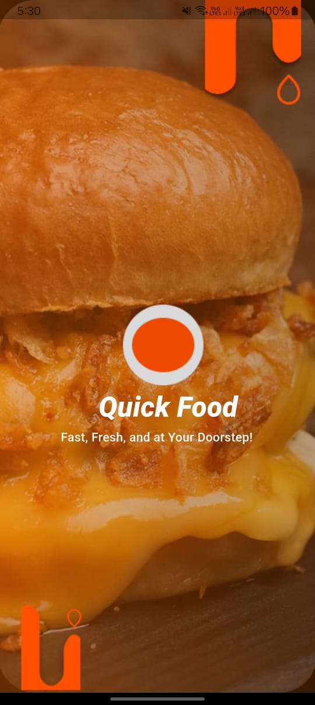
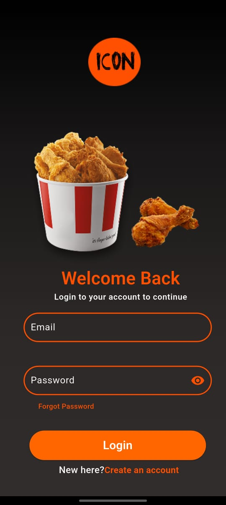
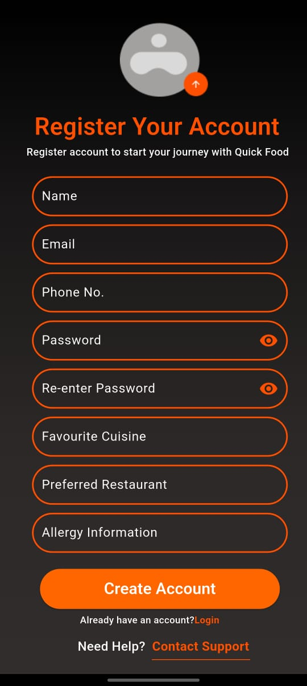

# 🚀 Day 4 – Figma to Flutter UI Re| Page           | Page            | My 

## 📋 Task Overview

Today's task was focused on **UI replication** using Flutter. I was assigned a Figma design and tasked to convert it into a working Flutter interface.

The goal was to **closely match the design** in layout, color scheme, typography, image placement, and overall styling.

---

## 🎯 Objective

- Replicate the given Figma design into Flutter screens.
- Implement proper UI structure using `Column`, `Stack`, `Container`, `Text`, and `Image` widgets.
- Apply linear gradients, custom fonts, and image assets to match the theme.
- Ensure responsiveness and visual accuracy.

---

## 🧱 Pages Replicated

| Page            | Description                                  |
|-----------------|----------------------------------------------|
| 🔹 Landing Page | A full-screen burger image with gradient and logo/text. |
| 🔹 Intro Page   | A welcome/info screen with themed background. |
| 🔹 Login Page   | Email/password form, social logins, and CTA. |
| 🔹 Register Page| Input fields for new user registration.       |

---

## 📸 Screenshots

### 🔻 Figma Designs
> *(Insert the Figma reference images here)*

| Page            | Design Preview |
|-----------------|----------------|
| Landing Page    |  |
| Intro Page      |      |
| Login Page      |      |
| Register Page   |  |

---

### 🔺 My Flutter UI Replication
> 

| Page            | My Design      |
|-----------------|----------------|
| Landing Page    |        |
| Intro Page      |            |
| Login Page      |            |
| Register Page   |      |

---

