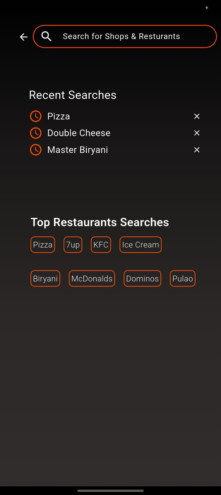
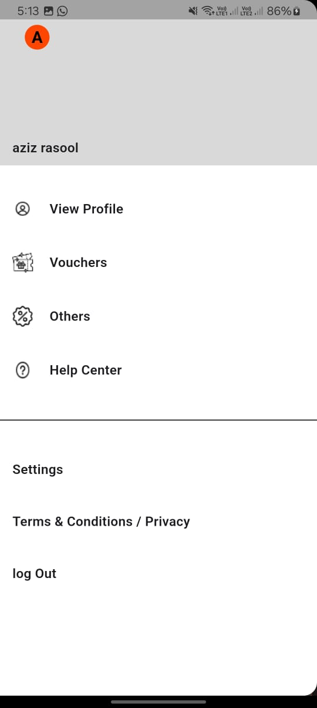
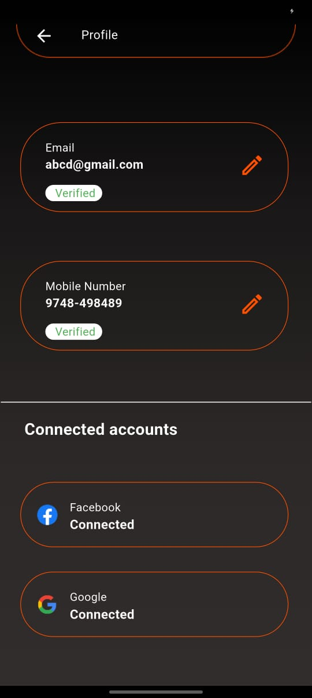
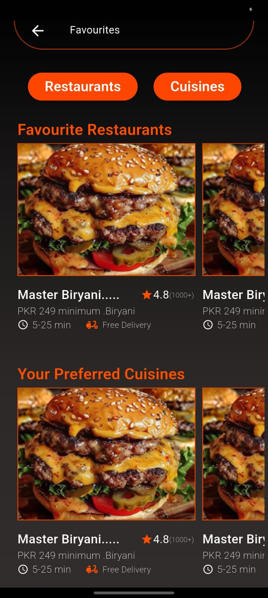
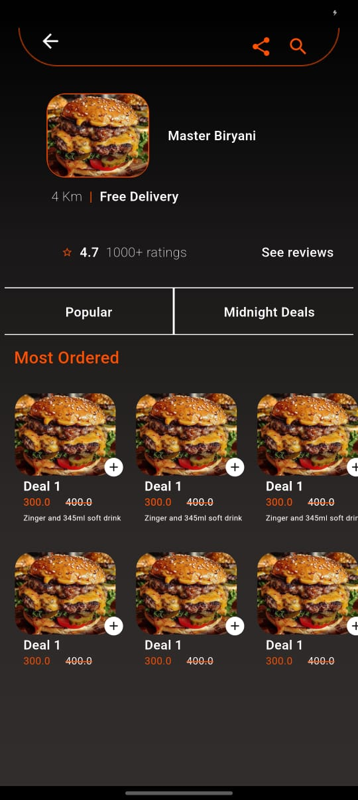

# 📅 Day 5 – Figma UI Cloning Progress

On **Day 5**, I continued refining and expanding the UI screens cloned from the Figma design. This day focused on improving user experience and adding essential pages to enhance app navigation and personalization.

---

## ✅ What's New Today?

- 🔍 **Improved Search Page**  
  ➤ Enhanced layout, better spacing, and cleaner result view.

- 📂 **New Screens Added**
  - App Drawer (with navigation)
  - User Profile Page
  - Favourite Page
  - Order Page

---

## 🖼️ UI Screens (Preview)

  
  
  
  
  

> 📌 *All screens are designed to match the Figma reference while staying clean, responsive, and functional.*

---

## 🛠️ Tech Used

- Flutter 3.x
- Dart
- Figma (Design Reference)
- Drawer & Navigation Widgets

---

📁 _This log is part of my daily progress to document and showcase the UI cloning journey from Figma to Flutter._

