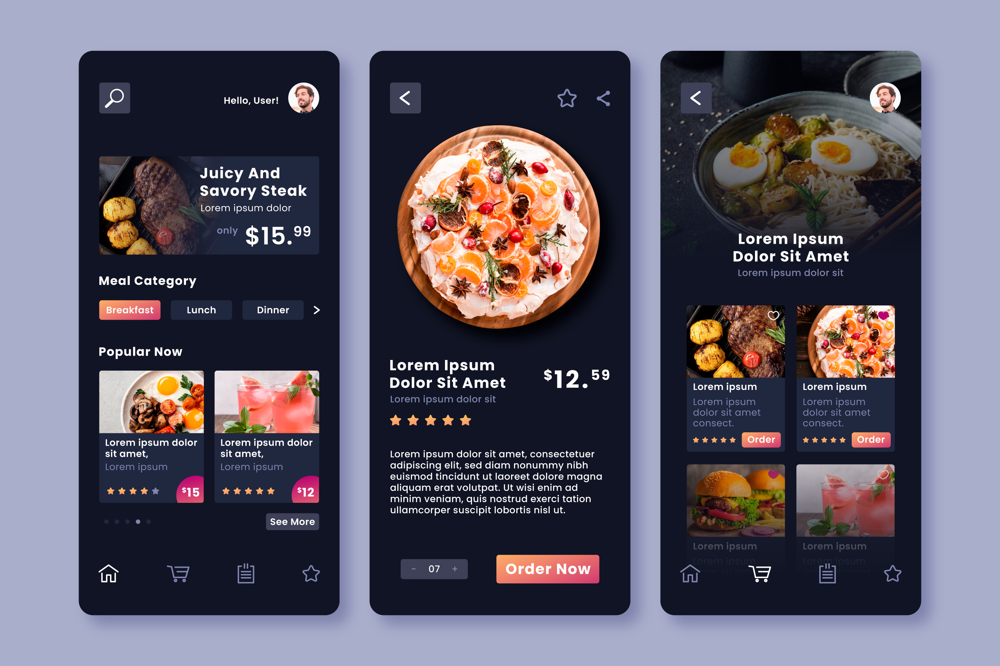
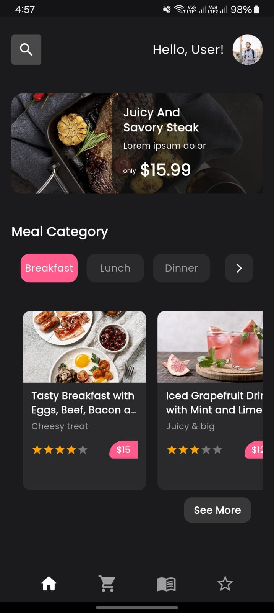
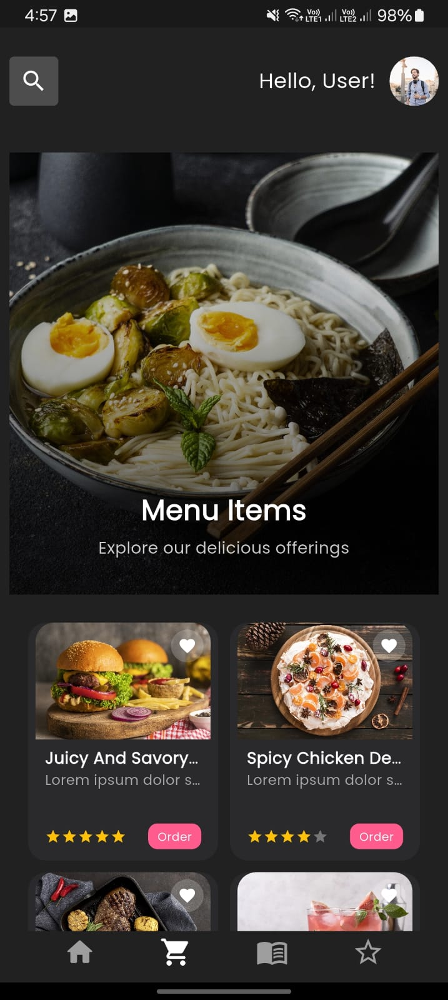
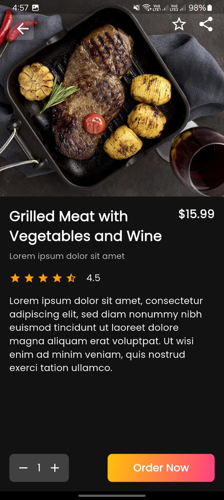

# 🍔 Flutter Food App UI

A Flutter-based modern food delivery app UI that replicates a sleek and functional design using Provider for state management. The app includes a Home screen, Menu screen with a responsive grid, and a detailed Description screen.

---

## 🎯 Objective

Recreate the following UI design accurately in Flutter:

### 📌 Provided Design Reference

---

## 📱 App Screenshots

> Screenshots will be updated once all UI components are fully developed.

| Home Screen | Menu Screen | Description Screen |
|-------------|-------------|---------------------|
|  |  |  |

---

## 🛠️ Features Implemented

- 👋 Personalized Home screen with user greeting, promo card, categories, and bottom navigation
- 🍽️ Menu screen with grid items, favorite toggling, and category display
- 📃 Description screen for individual food items (design and layout in progress)
- 💖 Favorite button with toggle interaction
- ⭐ Popular item card with ratings and price badge
- 🧭 Persistent bottom navigation bar with active tab highlight

---

