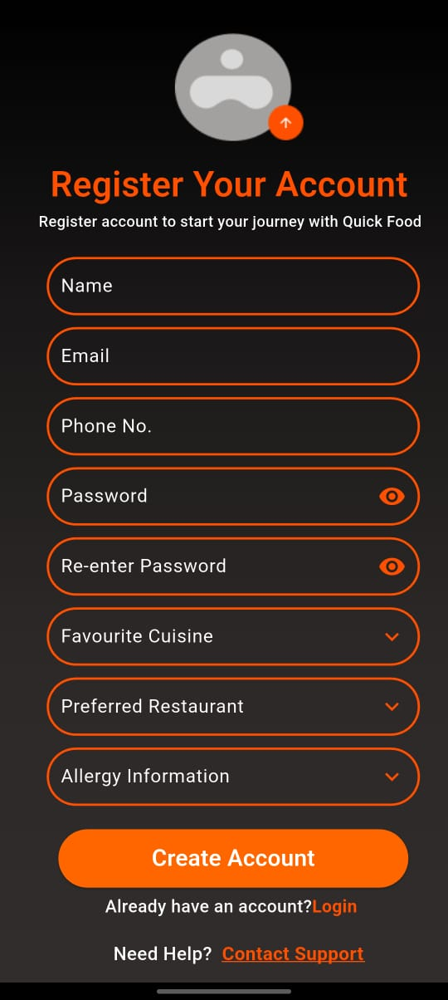
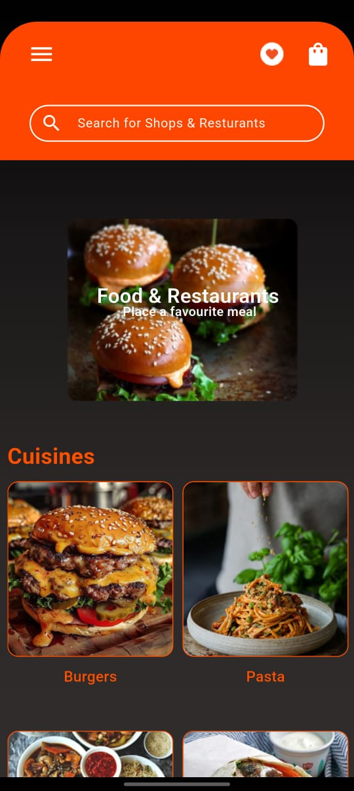
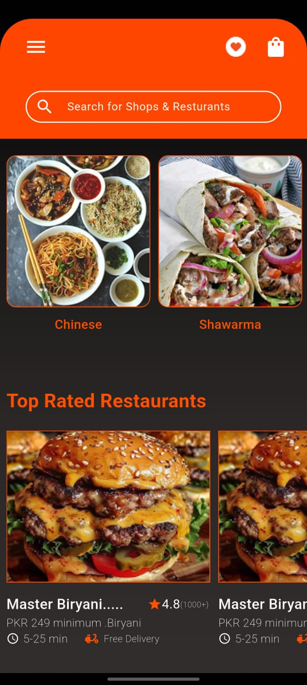
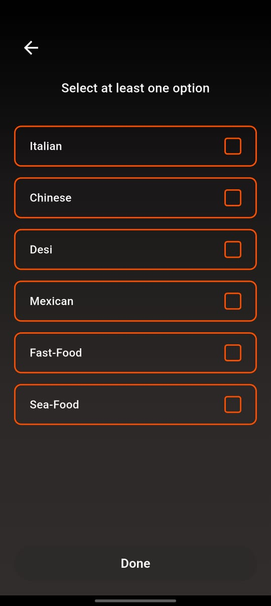
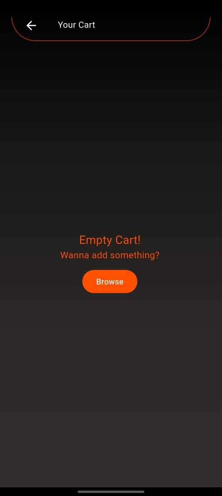
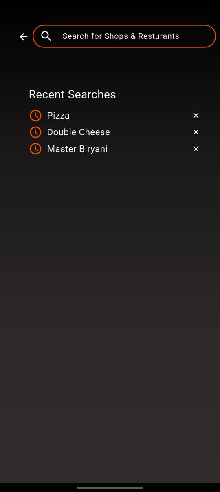

# 📅 Day 4 – Figma UI Cloning Progress

Today, I extended my work from **Day 3**, where I was cloning UI screens from the provided Figma design. On **Day 4**, I focused on building out more screens and enhancing the registration form with better UX elements like dropdowns.

---

## ✅ What's New Today?

- 🟧 **Improved Registration Page**  
  ➤ Added dropdowns for:
  - Favourite Cuisines (multi-select)
  - Preferred Restaurants
  - Allergy Information (optional)

- 📂 **New Screens Built**
  - Category Page
  - Homepage
  - Cart Page
  - Search Page

---

## 🖼️ UI Screens (Preview)

  
  
  
  
  
  

> 📌 *All UI elements are responsive and follow the structure defined in the Figma design.*

---

## 🛠️ Tech Used

- Flutter 3.x
- Dart
- Figma for design reference

---

## 🔜 Next Steps

- Implement navigation between pages
- Connect mock data to UI components
- Add state management (Provider/Bloc)

---

📁 _This log is part of my daily progress to document and showcase the UI cloning journey from Figma to Flutter._

