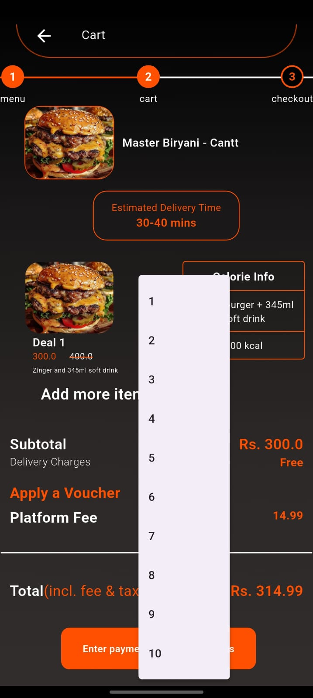
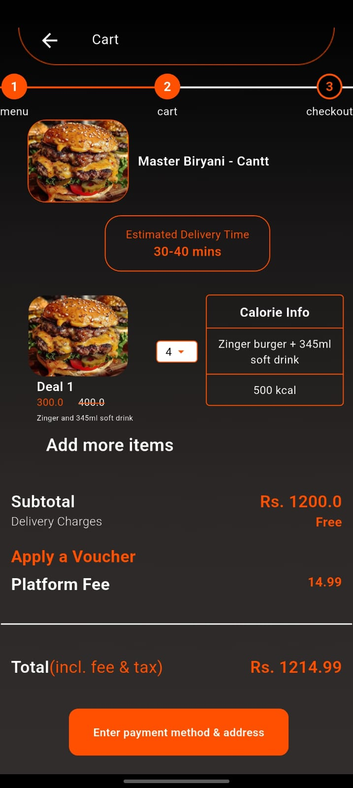
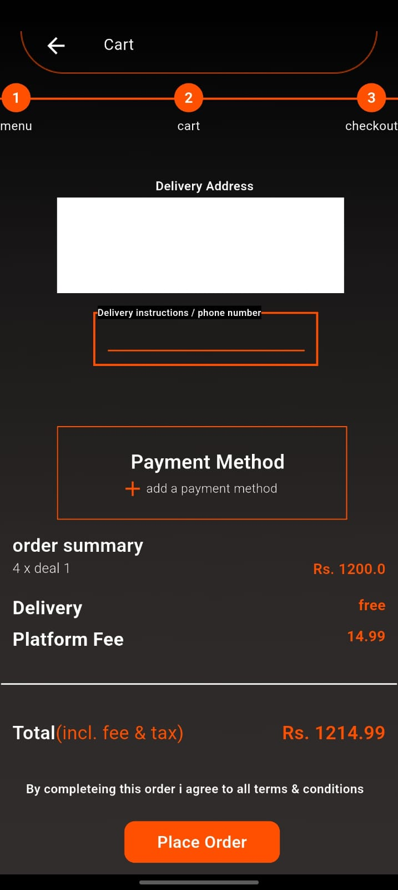

# 📅 Day 6 – Cart & Checkout Screen Completion  

On **Day 6**, I wrapped up the UI design work by building and connecting the **Cart** and **Checkout** screens. This included dynamic pricing updates using **GetX** state management and passing data seamlessly between pages.  

---

## ✅ What's New Today?  

- 🛒 **Cart Screen**  
  ➤ Shows items added to the cart, with **price updating in real time** based on quantity changes or selections.  

- 💳 **Checkout Screen**  
  ➤ Retrieves the **total amount** from the Cart screen using **GetX**, ensuring consistent state without complex boilerplate code.  

- 🎯 **State Management**  
  ➤ This time, **GetX** was used for reactive updates, resulting in smoother performance and cleaner code compared to previous approaches.  

---

## 🖼️ UI Screens (Preview)  

  
  
  
  

  

> 📌 *Cart page dynamically updates prices according to user selection. Checkout page retrieves and displays the accurate total from the Cart screen.*  

---

## 🛠️ Tech Used  

- Flutter 3.x  
- Dart  
- GetX (State Management)  
- Responsive UI Design Principles  

---

📁 _This log is part of my daily Flutter internship documentation, tracking progress from UI design to state-managed, functional screens._
