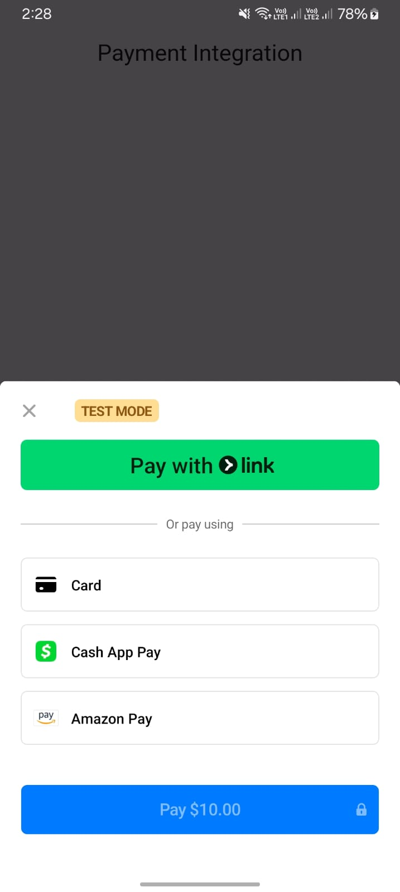
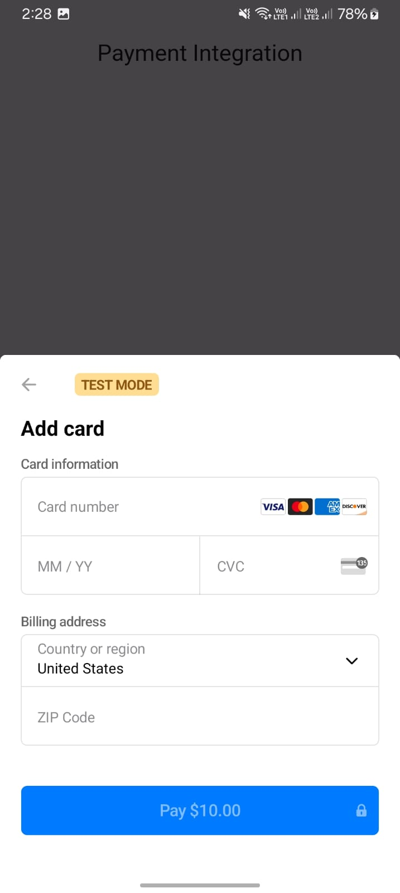
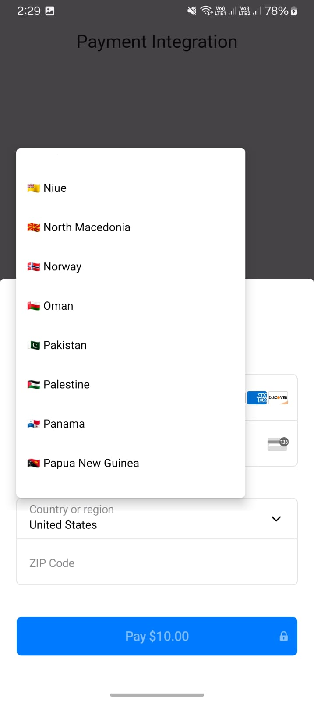
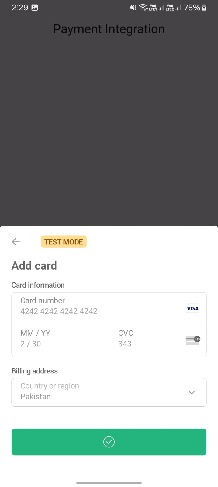

# 📅 Day 8 – Payment Gateway Integration

---

## 📌 Task Summary
On **Day 8**, I explored and implemented **payment gateway integration** in a Flutter app.  
For this, I used **Stripe** as the payment processor.

---

## ✅ What I Did Today
- 🆕 **Learned how to integrate payment gateways in Flutter**.
- 💳 Used **Stripe** for the integration.
- 🛠️ Created a **test account** on Stripe.
- 🔑 Generated and used **test API keys** for development.
- 🎯 Implemented a **payment call** triggered by a button press.
- 💵 Made **dummy payments** and confirmed they appeared in my Stripe test dashboard.

---

## 🖼️ UI & Payment Flow Screenshots (Preview)

  
  
  
  
  

> 📌 *These screenshots showcase the payment initiation, dummy payment process, and confirmation screens.*

---

## 🛠️ Tech Used
- **Flutter 3.x**
- **Dart**
- **Stripe Payment Gateway**
- **Stripe Test API Keys**

---

## 🚀 Learnings
- Understood **how payment gateways work** in mobile apps.
- Learned to **use Stripe test environment** for safe transactions.
- Practiced **API integration** and handling payment callbacks.

---
