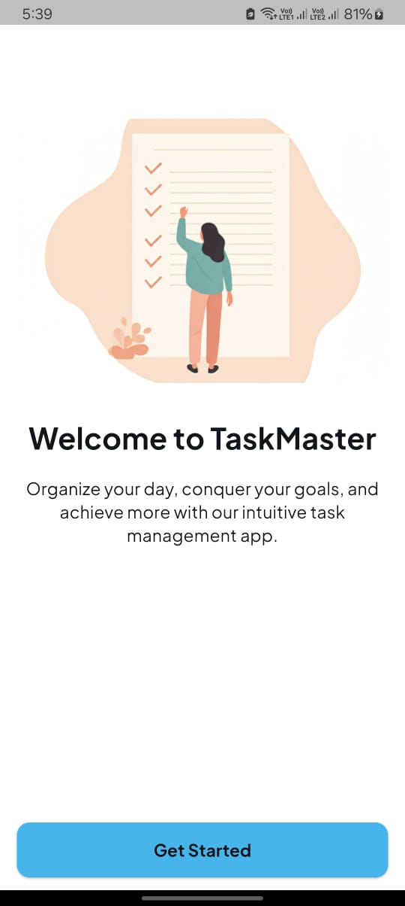
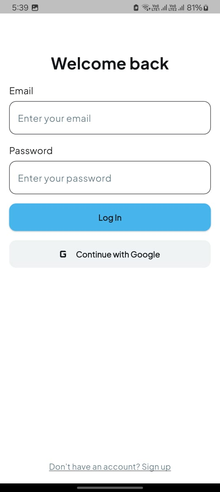
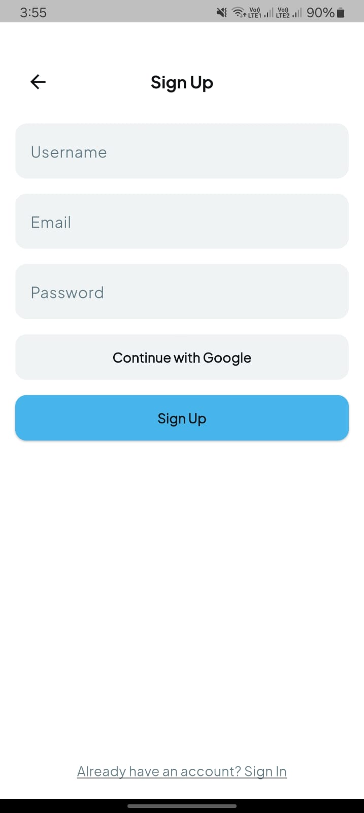
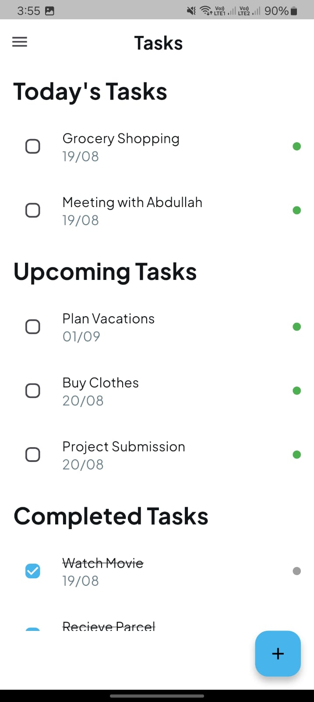
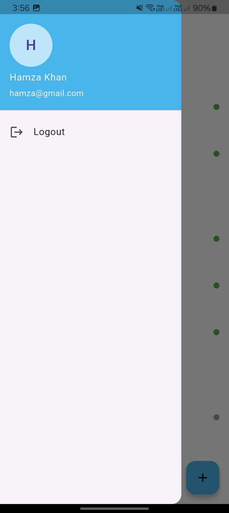
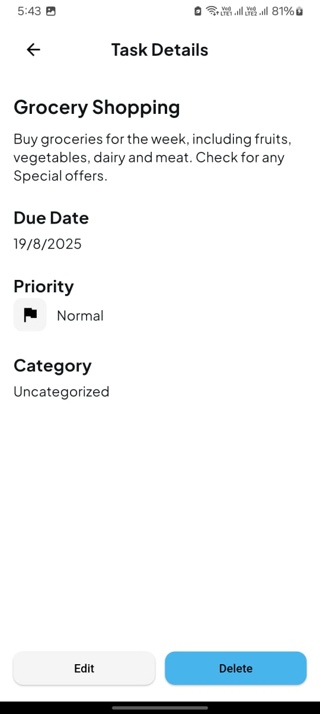
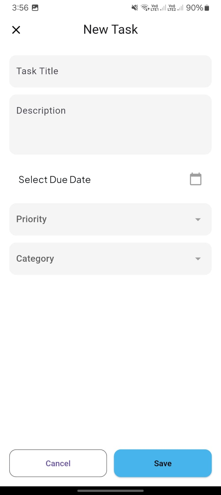

# Day 11 - ToDo App  

This is a **modern ToDo application** built with Flutter. The app allows users to manage their tasks by categorizing them into **Today's Tasks, Upcoming Tasks, and Completed Tasks**.  

---

## 📌 Features  
- Add new tasks with **title, description, and due date**  
- Tasks are organized into three categories:
  - ✅ Today's Tasks  
  - ⏳ Upcoming Tasks  
  - 🗂 Completed Tasks  
- Mark tasks as completed or pending  
- Dialog confirmation after adding a task  
- **Modern UI** with a clean, professional look  

---

## ⚙️ State Management  
This app uses **GetX** for state management:  
- `TaskController` manages the task list and provides helper methods.  
- Reactive updates with `Obx` and controller methods.  
- Lightweight and simple compared to Provider or Bloc.  

---

## 🎨 UI Design  
The UI was kept **modern and minimalistic**, focusing on:  
- Simple color scheme with emphasis on readability  
- Clear hierarchy between **headings (24–28)**, **subheadings (18)**, and **task items (14–16)**  
- Floating action button for quick task addition  

---

## 🖼️ Screenshots  

  
  
  
  
  
  
  

  

---

## 🔮 Future Work  
For the future, the app will be extended with **Firebase integration** to make it a complete **CRUD app** with:  
- User authentication  
- Persistent storage of tasks  
- Real-time sync across devices  

---
