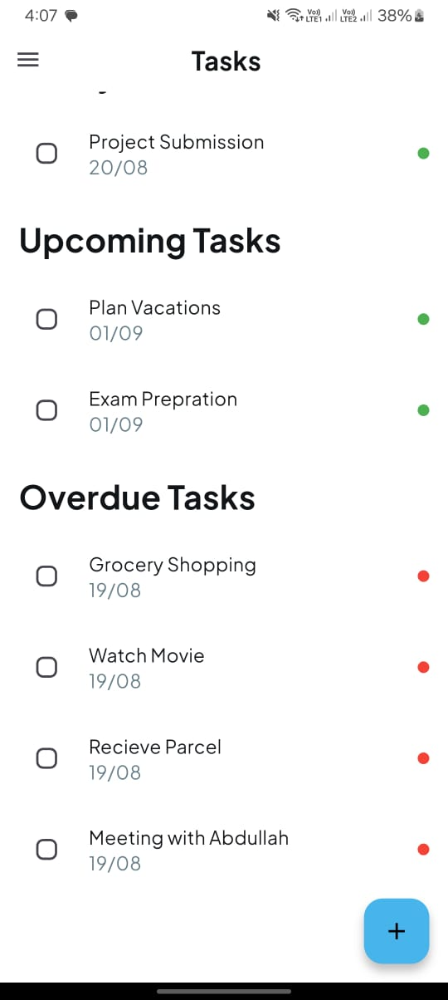
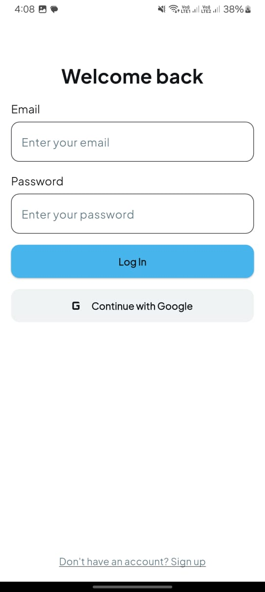
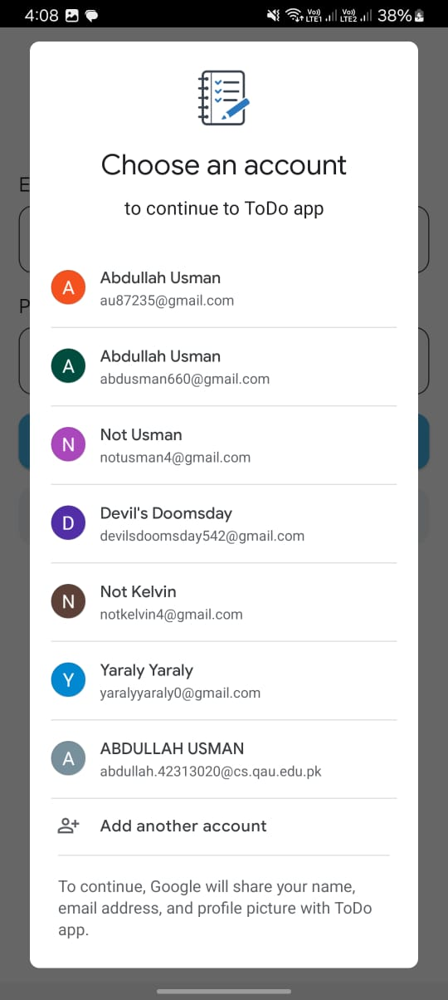

# Day 13 - ToDo App  

This is a **modern ToDo application** built with Flutter. Today’s work focused on improving functionality and enhancing authentication features.  

---

## 📌 Features  
- Added a new task category: **Overdue Tasks** (for tasks not completed on time).  
- Changed the **app icon and name** for a more personalized branding.  
- Integrated **Google Authentication with Firebase** for secure and easy login.  

---

## ⚙️ State Management  
This app continues to use **GetX** for state management:  
- `TaskController` manages the task list, including the new **Overdue category**.  
- Reactive updates with `Obx` to reflect task changes instantly.  
- Google Authentication integration works alongside the existing state setup.  

---

## 🎨 UI Design  
The UI was further polished with:  
- A new section for **Overdue Tasks** in the task screen.  
- Updated **app icon and app name** for better identity.  
- Smooth login experience with **Google Sign-In**.  

---

## 🖼️ Screenshots  

  
  
  

  

---

