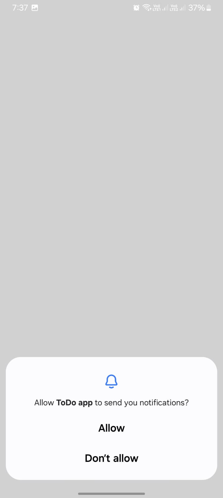
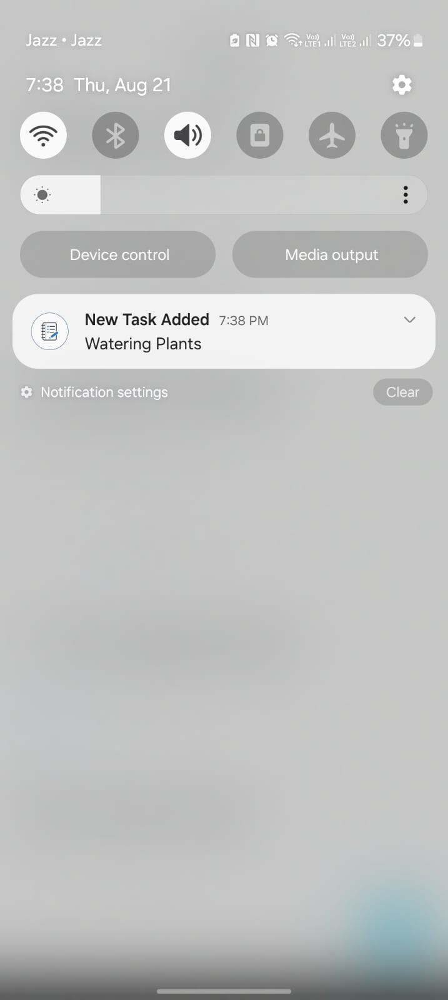
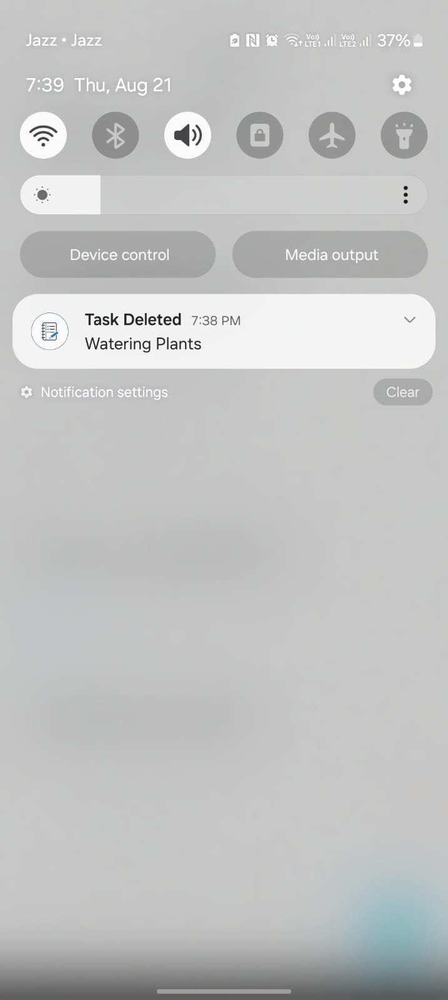

# 📌 Day 14 – Local Push Notifications in To-Do App

Today’s progress is all about **enhancing user experience with reminders** 🎉.  
I have integrated **local push notifications** into the app to keep users updated about their tasks.

---

## 🚀 Features Added
- 🔔 **Local Push Notifications**
  - 📅 **Task Creation** → Notification when a new task is created  
  - 🗑️ **Task Deletion** → Notification when a task is deleted  
  - ⏰ **Upcoming Tasks** → Notification when a scheduled task moves into the **Today’s Tasks** category  
  - ⚠️ **Overdue Tasks** → If a task is due but not marked as completed, the user gets a reminder notification the **next day at 9 AM**  

---

## 🛠️ Tech Stack
- **Framework**: Flutter  
- **State Management**: GetX  
- **Backend**: Firebase (Auth + Firestore)  
- **Notifications**: `flutter_local_notifications`  
- **Language**: Dart  

---

## 📷 Screenshots

  
  
  

  
---

With this, the app is no longer just a CRUD to-do app ✅ — it’s now a **smart task manager** that reminds users about their work at the right time. 🚀
